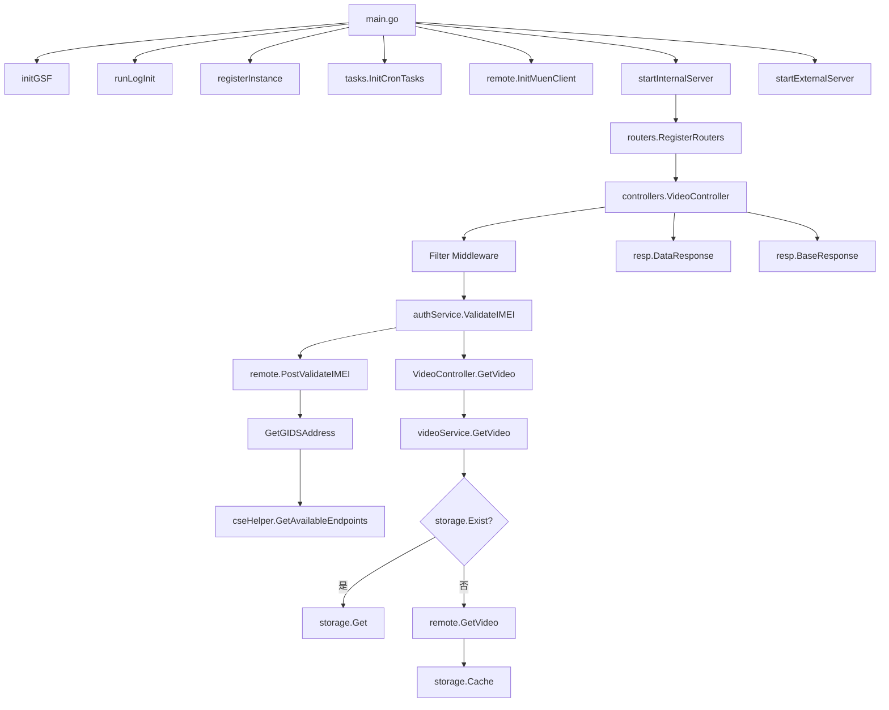
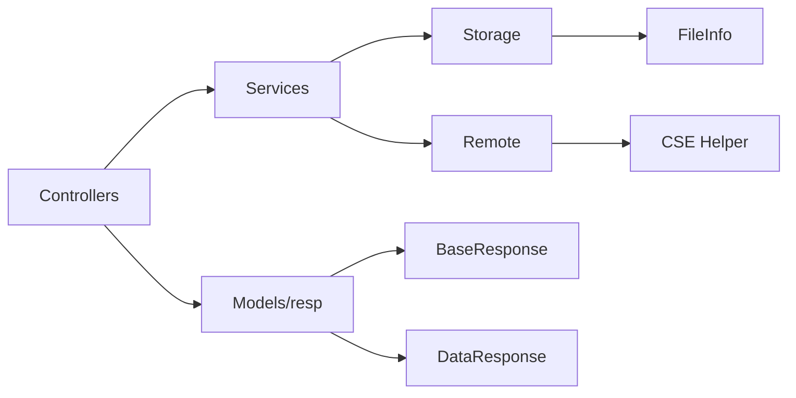
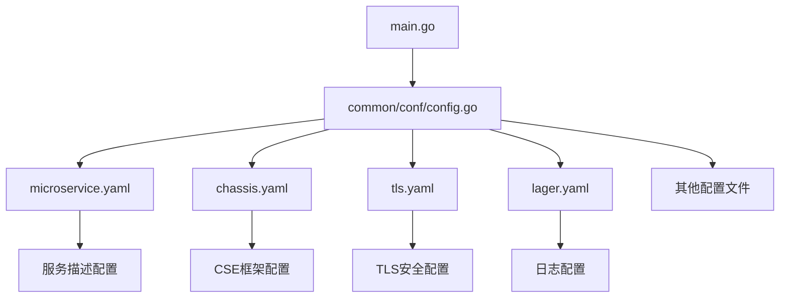

# MediaCacheService - Models 技术文档

## 文档信息
- **生成时间**: 2025-03-24
- **项目路径**: D:\CloudCellular\MediaCacheService
- **分析范围**: models目录及相关配置文件
- **文档版本**: 1.0

---

## 1. 项目概览

### 1.1 项目信息
MediaCacheService是一个基于Go语言开发的媒体缓存服务项目，采用华为CSP/Go-chassis微服务框架，主要功能为管理和缓存视频媒体文件。

### 1.2 技术栈
- **语言**: Go 1.20
- **框架**: Go-chassis (华为微服务框架) + Beego 2.x
- **主要依赖**:
  - CSPGSOMF, CSPNTP_SDK_GO, Go-chassis-extend (华为内部SDK)
  - AlarmSDK_GO, CSPGPSDK (告警和GPS功能)
  - greatwall-sdk-go, beego等(Go生态库)
- **架构模式**: 微服务架构，分层设计(MVC + 业务服务层)

### 1.3 项目结构

```
D:\CloudCellular\MediaCacheService\
├── build/                          # 构建部署相关
│   ├── build.sh                    # 构建脚本
│   ├── Dockerfile                  # Docker容器配置
│   ├── init.sh                     # 初始化脚本
│   ├── start.sh                    # 启动脚本
│   └── sudoer.config               # sudo权限配置
├── docs/                           # 项目文档
├── src/                            # 源代码目录
│   ├── cert/                       # 证书管理模块
│   ├── common/                     # 公共组件模块
│   │   ├── conf/                   # 配置文件处理
│   │   ├── constants/              # 常量定义
│   │   ├── error/                  # 错误处理
│   │   ├── https/                  # HTTP/HTTPS服务器
│   │   └── logger/                 # 日志管理
│   ├── conf/                       # 配置文件目录
│   ├── controllers/                # 控制器层
│   ├── cse/                        # 服务注册发现
│   ├── models/                     # 数据模型 ⭐
│   ├── remote/                     # 远程通信模块
│   ├── routers/                    # 路由配置
│   ├── service/                    # 业务服务层
│   ├── storage/                    # 存储模块
│   ├── tasks/                      # 定时任务
│   ├── util/                       # 工具类
│   ├── go.mod                      # Go模块管理
│   └── main.go                     # 主入口文件
└── README.md                       # 项目说明
```

---

## 2. Models目录详细分析

### 2.1 目录结构

models目录位于 `D:\CloudCellular\MediaCacheService\src\models\`，结构相对简洁：

```
models/
└── resp/
    └── base.go                     # 基础响应模型
```

### 2.2 包组织结构

**包信息**:
- **包名**: resp
- **文件数量**: 1个Go文件
- **主要功能**: 定义统一的API响应数据结构

### 2.3 数据模型定义

#### 2.3.1 BaseResponse 结构体

**文件位置**: `D:\CloudCellular\MediaCacheService\src\models\resp\base.go:6`

**定义**:
```go
type BaseResponse struct {
    Code    int    `json:"code"`
    Message string `json:"msg"`
}
```

**字段说明**:
- `Code` (int): HTTP状态码或业务状态码，用于表示请求结果状态
- `Message` (string): 状态消息描述，提供请求结果的详细信息

**JSON标签**:
- `code`: 输出时序列化为JSON的"code"字段
- `msg`: 输出时序列化为JSON的"msg"字段

**用途**: 作为所有API响应的基础结构，提供标准化的状态响应格式，便于客户端统一处理。

#### 2.3.2 DataResponse 结构体

**文件位置**: `D:\CloudCellular\MediaCacheService\src\models\resp\base.go:11`

**定义**:
```go
type DataResponse struct {
    BaseResponse                    // 匿名字段，继承BaseResponse
    Data interface{} `json:"data"`  // 数据载荷
}
```

**字段说明**:
- `BaseResponse`: 匿名字段，继承BaseResponse的Code和Message字段
- `Data` (interface{}): 泛型数据字段，可以承载任意类型的业务数据

**继承关系**:
- DataResponse 继承自 BaseResponse
- 拥有BaseResponse的所有字段(Code, Message)
- 额外增加Data字段用于携带业务数据

**JSON标签**:
- 继承BaseResponse的`code`和`msg`字段
- `data`: 数据载荷字段的JSON序列化名称

**用途**: 用于需要返回业务数据的API响应，在基础状态信息之上提供数据载荷。

### 2.4 数据模型关系图

```
BaseResponse (基础响应)
    │
    ├─ Code: int              # 状态码
    └─ Message: string        # 消息
            │
            ▼ 存在继承关系
DataResponse (数据响应)
    ├─ BaseResponse (继承)
    └─ Data: interface{}      # 数据载荷
```

### 2.5 响应模型示例

**基础响应示例**:
```json
{
    "code": 200,
    "msg": "操作成功"
}
```

**数据响应示例**:
```json
{
    "code": 200,
    "msg": "查询成功",
    "data": {
        "videoId": "12345",
        "name": "test.mp4",
        "size": 1048576
    }
}
```

---

## 3. 接口定义

### 3.1 接口概览
在models目录中，**没有定义任何接口(interface)**。

### 3.2 接口使用分析
虽然models目录未定义接口，但项目中其他模块定义了重要的接口：

#### 3.2.1 Storage接口 (storage/storage.go)
```go
type Storage interface {
    Cache(filePath string) (*FileInfo, error)
    Get(videoPath string) (io.ReadCloser, *FileInfo, error)
    Exist(filePath string) bool
}
```

#### 3.2.2 VideoService接口 (service/VideoService.go)
```go
type VideoService interface {
    GetVideo(videoPath string) (io.ReadCloser, *storage.FileInfo, error)
    Download(videoPath string) (io.ReadCloser, int64, error)
}
```

#### 3.2.3 AuthService接口 (service/auth_service.go)
```go
type AuthService interface {
    ValidateIMEI(imei string, checkType string) (bool, error)
}
```

#### 3.2.4 Remote接口 (remote/remote.go)
```go
type Remote interface {
    GetVideo(videoPath string) (io.ReadCloser, *storage.FileInfo, error)
    PostValidateIMEI(IMEI string, CheckType string) (bool, error)
    GetGIDSAddress() (string, error)
}
```

---

## 4. 函数定义与实现

### 4.1 Models目录函数分析
在models目录的`base.go`文件中，**没有定义任何函数(func)**。

### 4.2 项目核心函数调用关系

#### 4.2.1 主程序启动流程

```
main() ──►
    ├─ initGSF()                          # 初始化GSF框架
    ├─ runLogInit()                       # 初始化日志系统
    ├─ registerInstance()                  # 注册服务实例
    ├─ tasks.InitCronTasks()               # 初始化定时任务
    ├─ remote.InitMuenClient()             # 初始化远程客户端
    ├─ startInternalServer()               # 启动内部服务器
    │   └─ routers.RegisterRouters()       # 注册路由
    │       └─ controllers.VideoController() # 创建视频控制器
    └─ startExternalServer()               # 启动外部服务器
```

#### 4.2.2 视频缓存服务流程

```
VideoController.GetVideo() ──►
    ├─ authService.ValidateIMEI()         # IMEI验证
    │   └─ remote.PostValidateIMEI()       # 远程验证调用
    └─ videoService.GetVideo()             # 获取视频
        ├─ storage.Exist()                 # 检查缓存是否存在
        ├─ storage.Get()                   # 如果缓存存在，从存储获取
        └─ remote.GetVideo()               # 如果缓存不存在，远程获取
            └─ storage.Cache()             # 缓存到本地存储
```

#### 4.2.3 认证服务流程

```
AuthServiceImpl.ValidateIMEI(imei, checkType) ──►
    └─ remote.PostValidateIMEI(imei, checkType) ──►
        ├─ GetGIDSAddress()                  # 获取GIDS服务地址
        │   └─ cseHelper.GetAvailableEndpoints() # 获取服务端点
        └─ httpClient.Post(gidsURL, params)   # 发送验证请求
```

#### 4.2.4 数据模型使用流程

```
Controllers (控制器层)
    │
    ├─ 使用 resp.BaseResponse              # 基础响应
    │   └─ Code: 状态码
    │   └─ Message: 消息描述
    │
    └─ 使用 resp.DataResponse              # 数据响应
        ├─ 继承 BaseResponse
        └─ Data: 业务数据对象
            ├─ 视频信息
            ├─ 用户信息
            └─ 其他业务数据
```

### 4.3 核心函数参数与返回值

#### 4.3.1 VideoController方法

**GetVideo()**:
- **参数**: 无参数 (通过HTTP请求获取)
- **返回值**: void (直接写入ResponseWriter)

**Download()**:
- **参数**: 无参数 (通过HTTP请求获取)
- **返回值**: void (直接写入ResponseWriter)

#### 4.3.2 VideoService接口方法

**GetVideo(videoPath string)**:
- **参数**:
  - `videoPath` (string): 视频文件路径
- **返回值**: `(io.ReadCloser, *storage.FileInfo, error)`
  - `io.ReadCloser`: 视频流读取器
  - `*storage.FileInfo`: 文件元数据信息
  - `error`: 错误信息

**Download(videoPath string)**:
- **参数**:
  - `videoPath` (string): 视频文件路径
- **返回值**: `(io.ReadCloser, int64, error)`
  - `io.ReadCloser`: 视频流读取器
  - `int64`: 文件大小
  - `error`: 错误信息

#### 4.3.3 AuthService接口方法

**ValidateIMEI(imei string, checkType string)**:
- **参数**:
  - `imei` (string): 设备IMEI号
  - `checkType` (string): 验证类型
- **返回值**: `(bool, error)`
  - `bool`: 验证结果(true/false)
  - `error`: 错误信息

#### 4.3.4 Remote接口方法

**GetVideo(videoPath string)**:
- **参数**:
  - `videoPath` (string): 视频路径
- **返回值**: `(io.ReadCloser, *storage.FileInfo, error)`

**PostValidateIMEI(IMEI string, CheckType string)**:
- **参数**:
  - `IMEI` (string): 设备IMEI
  - `CheckType` (string): 验证类型
- **返回值**: `(bool, error)`

**GetGIDSAddress()**:
- **参数**: 无
- **返回值**: `(string, error)`
  - `string`: GIDS服务地址URL
  - `error`: 错误信息

#### 4.3.5 Storage接口方法

**Cache(filePath string)**:
- **参数**:
  - `filePath` (string): 文件路径
- **返回值**: `(*FileInfo, error)`
  - `*FileInfo`: 文件信息结构体指针
  - `error`: 错误信息

**Get(videoPath string)**:
- **参数**:
  - `videoPath` (string): 视频路径
- **返回值**: `(io.ReadCloser, *FileInfo, error)`

**Exist(filePath string)**:
- **参数**:
  - `filePath` (string): 文件路径
- **返回值**: `bool` (文件是否存在)

### 4.4 数据结构定义

#### 4.4.1 FileInfo结构体 (storage/storage.go)
```go
type FileInfo struct {
    Name              string
    Path              string
    Size              int64
    ModifiedTime      time.Time
    Hash              string
    HasCached         bool
    ExtraWriteTarget  string
    Finalizer         func()
}
```

**字段说明**:
- `Name`: 文件名称
- `Path`: 文件路径
- `Size`: 文件大小(字节)
- `ModifiedTime`: 文件修改时间
- `Hash`: 文件哈希值
- `HasCached`: 是否已缓存
- `ExtraWriteTarget`: 额外写入目标
- `Finalizer`: 清理函数

---

## 5. 函数调用关系图

### 5.1 完整调用链图



### 5.2 依赖关系图



### 5.3 配置加载流程



---

## 6. 配置文件详解

### 6.1 配置文件概览

项目包含11个配置文件，主要位于 `D:\CloudCellular\MediaCacheService\src\conf\` 目录：

| 序号 | 文件名 | 类型 | 主要用途 |
|------|--------|------|----------|
| 1 | microservice.yaml | YAML | 微服务描述配置 |
| 2 | chassis.yaml | YAML | CSE框架配置 |
| 3 | tls.yaml | YAML | TLS/SSL安全配置 |
| 4 | lager.yaml | YAML | 日志配置 |
| 5 | app.conf | CONF | 应用基础配置 |
| 6 | centerLogConf.json | JSON | 集中日志配置 |
| 7 | circuit_breaker.yaml | YAML | 熔断器配置 |
| 8 | load_balancing.yaml | YAML | 负载均衡配置 |
| 9 | recovery.yaml | YAML | 服务恢复配置 |
| 10 | policy.json | JSON | API策略配置 |
| 11 | sudoer.config | CONF | 部署权限配置 |

### 6.2 核心配置文件详解

#### 6.2.1 microservice.yaml (微服务描述配置)

**文件位置**: `D:\CloudCellular\MediaCacheService\src\conf\microservice.yaml`

**完整内容**:
```yaml
#微服务的私有属性
service_description:
  name: mediacache              # 微服务名称
  version: 0.1                  # 服务版本号
  instance_description:
    properties:
      supervison: disable       # 监控状态: 禁用
healthcheck:
  port: 23711                   # 健康检查端口
  path: /healthcheck            # 健康检查路径
```

**配置说明**:

1. **service_description**: 服务元数据
   - `name`: mediacache - 服务注册名称
   - `version`: 0.1 - 服务版本，用于版本控制
   - `supervison`: disable - 禁用自动监控

2. **healthcheck**: 健康检查配置
   - `port`: 23711 - 健康检查监听端口
   - `path`: /healthcheck - 健康检查URL路径

**用途**:
- 向CSE服务注册中心注册服务元数据
- 定义服务的健康检查接口
- 支持服务发现和负载均衡

#### 6.2.2 chassis.yaml (CSE框架核心配置)

**文件位置**: `D:\CloudCellular\MediaCacheService\src\conf\chassis.yaml`

**关键配置解析**:

```yaml
# 应用ID (华为云平台标识)
APPLICATION_ID: CSP

cse:
  service:
    registry:
      type: servicecenter                    # 注册中心类型
      scope: full                            # 服务范围: 全局(允许跨应用)
      address: https://cse-service-center.manage:30100  # 注册中心地址
      refeshInterval: 30s                    # 刷新间隔: 30秒
      timeout: 4s                            # 超时时间: 4秒
      watch: true                            # 启用服务监听
      autodiscovery: true                    # 启用自动发现
      api:
        version: v4                          # API版本: v4

  protocols:
    rest:
      listenAddress: 127.0.0.1:9993          # REST监听地址
      advertiseAddress: 127.0.0.1:9996       # REST对外发布地址
      transport: tcp                         # 传输协议: TCP
      workerNumber: 10                       # 工作线程数: 10
      failure: http_500,http_502             # 失败判定: 500和502错误

  references:                                # 引用的微服务列表
    OM_MGR:
      version: 0+
      transport: rest
    ModuleKeeper:
      version: 0+
      transport: rest
    GaussDB:
      version: 0+
      transport: rest
    # ... 更多微服务引用

  arb_configuration:                         # 仲裁配置
    arbType: 1                               # 仲裁类型: 1-主备仲裁
    fastheartbeat:
      FastHeartbeatOpen: true                # 开启快心跳
    HTimeSec: 1                              # 心跳间隔: 1秒
    HTimeNum: 25                             # 快心跳失败阈值: 25
    needReboot: 1                            # 需要重启
```

**配置详解**:

**1. 服务注册配置**:
- `type: servicecenter` - 使用华为ServiceCenter作为注册中心
- `scope: full` - 允许跨应用访问，可见其他租户的全部微服务
- `address: https://cse-service-center.manage:30100` - 服务注册中心地址，采用HTTPS安全连接
- `watch: true` - 启用服务变更监听，自动更新服务列表
- `autodiscovery: true` - 自动发现新注册的服务

**2. REST协议配置**:
- `listenAddress: 127.0.0.1:9993` - 内部服务监听地址(服务间通信)
- `advertiseAddress: 127.0.0.1:9996` - 对外发布地址(提供给其他服务)
- `workerNumber: 10` - 10个工作线程处理并发请求
- `failure: http_500,http_502` - 当遇到500或502错误时判定为服务不可用

**3. 微服务引用**:
项目引用了以下微服务:
- **OM_MGR**: 运维管理服务
- **ModuleKeeper**: 模块管理服务
- **GaussDB**: 数据库服务
- **OpsAgent**: 运维代理服务
- **FMService**: 故障管理服务
- **PaaSBroker**: 平台Broker服务
- **CSPAOD**: AOD服务
- **AuditLog**: 审计日志服务
- **Privilege**: 权限服务

**4. 仲裁配置**:
- `arbType: 1` - 采用主备仲裁模式(相对负荷分担模式)
- `HTimeSec: 1` - 心跳间隔1秒，快速检测服务健康状态
- `HTimeNum: 25` - 连续25次心跳失败判定服务不可用

**本地开发配置**:
```yaml
# 开发环境可修改为:
address: http://127.0.0.1:30100  # 本地ServiceCenter
```

#### 6.2.3 tls.yaml (TLS/SSL安全配置)

**文件位置**: `D:\CloudCellular\MediaCacheService\src\conf\tls.yaml`

**配置结构**:

```yaml
ssl:
  # 服务注册中心TLS配置
  registry.Consumer.cipherPlugin:                    # 加密插件: aes
  registry.Consumer.verifyPeer: true                 # 验证对端证书
  registry.Consumer.cipherSuits:                     # 加密套件列表
  registry.Consumer.protocol: TLSv1.2                # TLS协议版本
  registry.Consumer.caFile:                          # CA证书路径
  registry.Consumer.certFile:                        # 客户端证书路径
  registry.Consumer.keyFile:                         # 客户端私钥路径
  registry.Consumer.certPwdFile:                     # 证书密码文件

  # MediaCache服务TLS配置
  mediacache.rest.Consumer.cipherPlugin: aes
  mediacache.rest.Consumer.verifyPeer: true
  mediacache.rest.Consumer.cipherSuits:
  mediacache.rest.Consumer.protocol: TLSv1.2
  mediacache.rest.Consumer.caFile:
  mediacache.rest.Consumer.certFile:
  mediacache.rest.Consumer.keyFile:
  mediacache.rest.Consumer.certPwdFile:

  mediacache.rest.Provider.cipherPlugin: aes         # 服务提供方配置
  mediacache.rest.Provider.verifyPeer: true
  mediacache.rest.Provider.cipherSuits:
  mediacache.rest.Provider.protocol: TLSv1.2
  mediacache.rest.Provider.keyFile:
  mediacache.rest.Provider.certFile:
  mediacache.rest.Provider.certPwdFile:
  mediacache.rest.Provider.caFile:

  # 其他微服务TLS配置...
  # AgentManager, ModuleKeeper, OM_MGR, FMService等
```

**加密套件列表**:
```
TLS_ECDHE_RSA_WITH_AES_128_GCM_SHA256
TLS_ECDHE_RSA_WITH_AES_256_GCM_SHA384
TLS_AES_128_GCM_SHA256
TLS_AES_256_GCM_SHA384
TLS_CHACHA20_POLY1305_SHA256
```

**配置微服务列表** (均配置了TLS):
1. **registry**: 服务注册中心
2. **mediacache**: 当前服务 (Consumer + Provider)
3. **AgentManager**: 代理管理服务
4. **ModuleKeeper**: 模块管理服务
5. **OM_MGR**: 运维管理服务
6. **Transport**: 传输服务 (Consumer + Provider)
7. **configcenter**: 配置中心服务
8. **FMService**: 故障管理服务
9. **AuditLog**: 审计日志服务
10. **Privilege**: 权限服务
11. **BackupMgr**: 备份管理服务
12. **Deploy_Mgr**: 部署管理服务
13. **OMCache**: OM缓存服务
14. **PMSMgr**: 性能管理服务

**证书文件路径**:
```yaml
/opt/csp/mediacache/cert/
├── ca.crt              # CA根证书
├── tls.crt             # 服务证书
├── tls.key.pwd         # 私钥文件(密码保护)
└── pwd                 # 证书密码文件
```

**安全特性**:
- **TLSv1.2**: 强制使用TLS 1.2或更高版本
- **双向认证**: verifyPeer: true (验证服务端和客户端证书)
- **强加密套件**: 仅使用AEAD加密套件(认证加密)
- **证书密码保护**: 私钥文件使用密码加密

**本地开发配置**:
```yaml
# 本地开发时注释整个文件内容，禁用TLS验证
# 注释: #本地运行注释整个文件内容
```

#### 6.2.4 lager.yaml (日志配置)

**文件位置**: `D:\CloudCellular\MediaCacheService\src\conf\lager.yaml`

**配置解析**:
```yaml
# 日志文件路径配置
Level: INFO                            # 日志级别
File: /opt/mtuser/mcs/log/log1/mcs.log # 日志文件路径
Rotation:
  maxSize: 20                          # 单文件最大20MB
  maxBackups: 30                       # 保留30个历史文件
  maxAge: 30                           # 保留30天
  compress: true                       # 启用压缩
  reservedDiskspace: 1024              # 预留1GB磁盘空间

# 集中日志配置
centralized:
  enabled: true                        # 启用集中日志
  storagePath: /opt/container/log/${APPID}/mediacache/mediacache.log
  storageDir: mediacache               # 存储目录
  storageRoot: SUM                     # 存储根路径
```

**日志级别**: INFO (可配置DEBUG, INFO, WARN, ERROR)

**日志轮转策略**:
- 单文件最大20MB
- 保留30个历史文件
- 历史文件保留30天
- 自动压缩旧日志
- 预留1GB磁盘空间防止磁盘写满

**日志路径**:
- 本地日志: `/opt/mtuser/mcs/log/log1/mcs.log`
- 集中日志: `/opt/container/log/${APPID}/mediacache/mediacache.log`

#### 6.2.5 app.conf (应用基础配置)

**文件位置**: `D:\CloudCellular\MediaCacheService\src\conf\app.conf`

**配置内容**:
```ini
app_id = 0
platform = kuber
app_name = MCS

# HTTP服务端口
http_port = 9996        # 内部HTTP端口
https_port = 9997       # 内部HTTPS端口

# 外部服务端口
external_http_port = 9990   # 外部HTTP端口
external_https_port = 9991  # 外部HTTPS端口

# 日志配置
log_level = INFO
log_file = /dev/out

# Moon配置
moon_config = ...
```

**端口配置**:
- **内部服务**: 9996(HTTP), 9997(HTTPS) - 用于微服务间通信
- **外部服务**: 9990(HTTP), 9991(HTTPS) - 用于外部客户端访问

#### 6.2.6 centerLogConf.json (集中日志配置)

**文件位置**: `D:\CloudCellular\MediaCacheService\src\conf\centerLogConf.json`

**配置内容**:
```json
{
  "enabled": true,                               # 启用集中日志
  "storagePath": "/opt/container/log/${APPID}/mediacache/mediacache.log",
  "storageDir": "mediacache",                    # 存储目录名称
  "storageRoot": "SUM",                          # 存储根路径
  "localLogNumber": 30,                          # 本地保留日志数量
  "localLogSize": 20,                            # 单个日志文件大小(MB)
  "logFilePath": "/opt/container/log/${APPID}/mediacache/mediacache.log"
}
```

**配置说明**:
- 启用集中存储: true
- 本地日志数量: 30个
- 本地日志大小: 20MB
- 日志文件路径含环境变量`${APPID}`，运行时动态替换

#### 6.2.7 circuit_breaker.yaml (熔断器配置)

**重要配置项**:
```yaml
cse:
  handler:
    chain:
      Provider:
        default: bizkeeper-consumer  # 熔断器提供方
      Consumer:
        default: bizkeeper-provider  # 熔断器消费方
  loadbalance:
    strategy:
      name: RoundRobin              # 负载均衡策略: 轮询
```

**熔断机制**:
- 防止级联故障
- 自动隔离故障微服务
- 支持自动恢复

#### 6.2.8 load_balancing.yaml (负载均衡配置)

**配置内容**:
```yaml
cse:
  loadbalance:
    strategy:
      name: RoundRobin              # 轮询策略
      retryEnabled: true            # 启用重试
      retryOnNext: 2                # 重试次数
      retryOnSame: 0                # 同节点不重试
```

**负载均衡策略**: RoundRobin (也可配置Random, WeightedResponse等)

**重试策略**:
- 启用自动重试
- 最多重试2次(切换到其他节点)
- 同节点失败不重试

#### 6.2.9 recovery.yaml (服务恢复配置)

**配置内容**:
```yaml
cse:
  isolation:
    Consumer:
      timeout:
        enabled: true
        timeoutInMilliseconds: 3000  # 超时时间: 3秒
      maxConcurrentRequests: 100     # 最大并发请求: 100
```

**恢复机制**:
- 超时隔离: 超过3秒自动隔离
- 并发限制: 最多100个并发请求
- 防止雪崩效应

#### 6.2.10 policy.json (API策略配置)

**配置内容**:
```json
{
  "timeout": 10000,                     # 超时时间: 10秒
  "concurrentLimit": 100,               # 并发限制: 100
  "rateLimit": {                        # 速率限制
    "enabled": true,
    "qps": 1000                         # 每秒最大请求数: 1000
  }
}
```

**API策略**:
- 超时控制: 10秒
- 并发限制: 100
- 流量控制: 1000 QPS

#### 6.2.11 sudoer.config (部署权限配置)

**文件位置**: `D:\CloudCellular\MediaCacheService\build\sudoer.config`

**配置内容**:
```
# 部署脚本sudo权限配置
...

# 用于Docker容器、服务启动等操作
```

### 6.3 配置文件加载顺序

```
应用启动
    │
    ├─► 加载app.conf (基础配置)
    ├─► 加载microservice.yaml (服务描述)
    ├─► 加载chassis.yaml (CSE框架)
    ├─► 加载tls.yaml (安全配置)
    ├─► 加载lager.yaml (日志配置)
    ├─► 加载centerLogConf.json (集中日志)
    ├─► 加载circuit_breaker.yaml (熔断器)
    ├─► 加载load_balancing.yaml (负载均衡)
    ├─► 加载recovery.yaml (服务恢复)
    └─► 加载policy.json (API策略)
```

### 6.4 配置文件依赖关系

```
config.go (配置管理器)
    │
    ├─► microservice.yaml  ──► 服务注册
    ├─► chassis.yaml       ──► CSE框架初始化
    ├─► tls.yaml           ──► 建立安全连接
    ├─► lager.yaml         ──► 初始化日志系统
    ├─► centerLogConf.json ──► 集中日志配置
    ├─► circuit_breaker    ──► 熔断器配置
    ├─► load_balancing     ──► 负载均衡配置
    ├─► recovery           ──► 服务恢复配置
    └─► policy.json        ──► API策略配置
```

---

## 7. 数据类型定义

### 7.1 Models目录类型定义

在models目录中，定义了以下类型：

#### 7.1.1 BaseResponse (结构体)
```go
type BaseResponse struct {
    Code    int
    Message string
}
```

#### 7.1.2 DataResponse (结构体)
```go
type DataResponse struct {
    BaseResponse
    Data interface{}
}
```

### 7.2 项目其他重要类型定义

#### 7.2.1 FileInfo (storage/storage.go)
```go
type FileInfo struct {
    Name              string
    Path              string
    Size              int64
    ModifiedTime      time.Time
    Hash              string
    HasCached         bool
    ExtraWriteTarget  string
    Finalizer         func()
}
```

#### 7.2.2 AlarmEvent (service/AlarmService.go)
```go
type AlarmEvent struct {
    AlarmID        string
    AlarmLevel     int
    AlarmType      string
    AlarmTitle     string
    AlarmContent   string
    AlarmTime      time.Time
    ResourceID     string
    ResourceType   string
}
```

### 7.3 类型分类

| 类型 | 用途 | 文件位置 |
|------|------|----------|
| BaseResponse | 基础API响应 | models/resp/base.go |
| DataResponse | 带数据的API响应 | models/resp/base.go |
| FileInfo | 文件元数据 | storage/storage.go |
| AlarmEvent | 告警事件 | service/AlarmService.go |

---

## 8. API响应设计模式

### 8.1 统一响应格式

项目采用统一的API响应格式，基于models/resp包定义的结构体：

**成功响应**:
```json
{
    "code": 200,
    "msg": "操作成功",
    "data": {
        // 业务数据
    }
}
```

**失败响应**:
```json
{
    "code": 500,
    "msg": "服务器内部错误"
}
```

### 8.2 响应状态码设计

| 状态码 | 含义 | 使用场景 |
|--------|------|----------|
| 200 | 成功 | 业务操作成功 |
| 400 | 请求错误 | 参数错误、格式错误 |
| 401 | 未授权 | IMEI验证失败 |
| 404 | 资源不存在 | 视频缓存不存在 |
| 500 | 服务器错误 | 内部异常 |

### 8.3 响应模型使用示例

#### 8.3.1 控制器使用示例

```go
// 成功响应示例
func (c *VideoController) GetVideo() {
    // ... 业务逻辑

    response := resp.DataResponse{
        BaseResponse: resp.BaseResponse{
            Code:    200,
            Message: "获取视频成功",
        },
        Data: videoInfo,
    }

    c.Data["json"] = response
    c.ServeJSON()
}

// 失败响应示例
func (c *VideoController) GetVideo() {
    if err != nil {
        response := resp.BaseResponse{
            Code:    500,
            Message: "获取视频失败: " + err.Error(),
        }
        c.Data["json"] = response
        c.ServeJSON()
        return
    }
}
```

---

## 9. 架构设计总结

### 9.1 分层架构

```
┌─────────────────────────────────────┐
│         Controllers (控制器层)       │  ← HTTP请求处理、路由分发
│         使用: resp.DataResponse      │
├─────────────────────────────────────┤
│         Services (业务服务层)        │  ← 业务逻辑、IMEI验证
│         使用: VideoService,          │
│              AuthService             │
├─────────────────────────────────────┤
│         Storage (存储层)             │  ← 缓存管理、文件操作
│         使用: Storage接口, FileInfo  │
├─────────────────────────────────────┤
│              Remote (远程层)         │  ← 微服务通信、CSE调用
│         使用: Remote接口             │
└─────────────────────────────────────┘
              ↑
              │
         Models/resp (数据模型)
         BaseResponse, DataResponse
```

### 9.2 核心设计原则

1. **单一职责**: 每层职责明确，职责分离
2. **开闭原则**: 接口定义，易于扩展
3. **依赖倒置**: 高层依赖接口而非具体实现
4. **统一响应**: 使用Standardized response格式

### 9.3 关键特性

- **微服务架构**: 支持服务注册与发现
- **分层设计**: Controller → Service → Storage
- **统一响应**: BaseResponse + DataResponse
- **TLS安全**: 双向证书认证
- **熔断保护**: 防止级联故障
- **负载均衡**: 支持多种负载均衡策略

---

## 10. 总结

### 10.1 Models目录特点

1. **简洁精简**: 仅包含响应数据模型
2. **统一标准**: 提供统一的API响应格式
3. **易于扩展**: DataResponse的Data字段支持任意类型
4. **广泛使用**: 被所有Controllers层引用

### 10.2 配置管理特点

1. **配置分离**: 按功能模块分离配置文件
2. **安全优先**: TLS双向认证，强加密套件
3. **容错机制**: 熔断器、负载均衡、服务恢复
4. **日志完善**: 多级别日志 + 集中日志
5. **本地开发友好**: 支持开发环境配置切换

### 10.3 技术亮点

1. **华为云集成**: 深度集成CSP服务生态
2. **微服务框架**: 基于Go-chassis的完整微服务解决方案
3. **服务网格**: 支持服务发现、负载均衡、熔断限流
4. **安全保障**: TLS 1.2 + 双向认证 + 强加密套件
5. **运维友好**: 健康检查、集中日志、告警集成

### 10.4 建议与改进方向

1. **模型扩展**: 考虑将业务领域模型(Domain Models)迁移到models目录
2. **配置中心**: 利用配置中心实现配置的动态更新
3. **API文档**: 集成Swagger等API文档工具
4. **单元测试**: 补充完整的单元测试覆盖
5. **监控增强**: 增加Prometheus等监控指标

---

## 附录

### A. 端口配置汇总

| 端口 | 协议 | 用途 |
|------|------|------|
| 9990 | HTTP | 外部HTTP服务 |
| 9991 | HTTPS | 外部HTTPS服务 |
| 9993 | HTTP | 内部服务监听 |
| 9996 | HTTP | 内部服务发布 |
| 9997 | HTTPS | 内部HTTPS服务 |
| 23711 | HTTP | 健康检查 |

### B. 证书文件路径

```
/opt/csp/mediacache/cert/
├── ca.crt              # CA根证书
├── tls.crt             # 服务证书
├── tls.key.pwd         # 私钥文件
└── pwd                 # 证书密码文件
```

### C. 日志文件路径

|日志类型|路径|
|--------|-----|
|本地日志|/opt/mtuser/mcs/log/log1/mcs.log|
|集中日志|/opt/container/log/${APPID}/mediacache/mediacache.log|

### D. 关键依赖版本

| 依赖 | 版本 |
|------|------|
| Go | 1.20 |
| go-chassis-extend | 最新 |
| Beego | 2.x |
| 华为CSP SDK | 内部版本 |

---

**文档结束**

*本文档由AI自动分析生成，如有疑问请联系项目维护人员。*