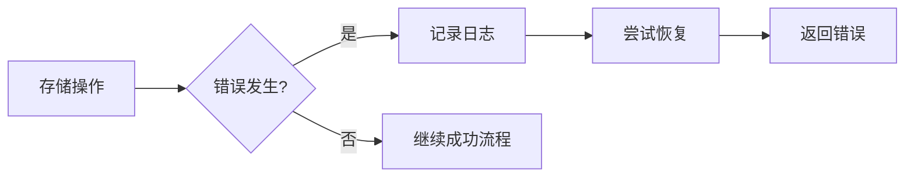

# MediaCacheService Storage 模块分析文档

## 目录
- [项目概述](#项目概述)
- [目录层级结构](#目录层级结构)
- [接口定义](#接口定义)
- [结构体定义](#结构体定义)
- [函数实现详解](#函数实现详解)
- [函数调用关系](#函数调用关系)

## 项目概述

MediaCacheService 是一个基于 Go 语言的媒体缓存服务系统，主要功能是从远程媒体服务器（MUEN）下载和缓存视频内容，并提供 HTTP 接口供客户端访问。

存储模块（storage）是该系统的核心组件，实现了统一的文件缓存接口，支持本地文件系统存储方式。该模块采用了接口驱动的设计模式，具有良好的扩展性和可维护性。

## 目录层级结构

```
D:\CloudCellular\MediaCacheService\src\
├── storage\                          # 存储模块
│   ├── storage.go                   # 存储接口和文件信息结构体定义
│   └── local_storage.go             # 本地存储实现
│
├── service\                          # 业务逻辑层
│   ├── VideoService.go              # 视频服务接口和实现
│   ├── AlarmService.go              # 告警服务
│   └── auth_service.go              # 认证服务
│
├── controllers\                      # 控制器层
│   ├── video_controller.go          # 视频控制器
│   ├── controller.go                # 基础控制器
│   └── filter.go                    # 过滤器
│
├── remote\                           # 远程访问层
│   └── remote.go                    # 远程服务接口和实现
│
├── common\                          # 公共模块
│   ├── conf\                        # 配置管理
│   │   └── config.go
│   ├── logger\                      # 日志
│   └── constants\                   # 常量定义
│
└── conf\                            # 配置文件
    ├── app.conf                     # 应用配置
    ├── chassis.yaml                 # 微服务配置
    └── 其他配置文件...
```

## 接口定义

### 1. Storage 接口

**文件位置**: `D:\CloudCellular\MediaCacheService\src\storage\storage.go`

```go
type Storage interface {
    Cache(filePath string) (*FileInfo, error)
    Get(videoPath string) (io.ReadCloser, *FileInfo, error)
    Exist(filePath string) bool
}
```

#### 接口方法说明

- **`Cache(filePath string) (*FileInfo, error)`**
  - 功能: 缓存文件并返回文件信息
  - 参数: filePath - 需要缓存的文件路径
  - 返回: FileInfo - 文件信息对象, error - 错误信息
  - 描述: 创建一个可写入的文件流，调用者可以将文件数据写入该流，文件将被保存在指定的缓存目录中

- **`Get(videoPath string) (io.ReadCloser, *FileInfo, error)`**
  - 功能: 从缓存中获取文件内容和文件信息
  - 参数: videoPath - 视频文件路径
  - 返回: io.ReadCloser - 文件读取流, FileInfo - 文件信息对象, error - 错误信息
  - 描述: 从本地缓存中读取已存在的文件，返回可读取的流和文件元数据

- **`Exist(filePath string) bool`**
  - 功能: 检查文件是否存在于缓存中
  - 参数: filePath - 文件路径
  - 返回: bool - 文件是否存在
  - 描述: 检查指定路径的文件是否已在本地缓存中存在

### 2. VideoService 接口

**文件位置**: `D:\CloudCellular\MediaCacheService\src\service\VideoService.go`

```go
type VideoService interface {
    GetVideo(videoPath string) (io.ReadCloser, *storage.FileInfo, error)
    Download(path string) (io.ReadCloser, int64, error)
}
```

#### 接口方法说明

- **`GetVideo(videoPath string) (io.ReadCloser, *storage.FileInfo, error)`**
  - 功能: 获取视频内容，优先从缓存获取，缓存不存在时从远程下载
  - 参数: videoPath - 视频文件路径
  - 返回: io.ReadCloser - 视频流, storage.FileInfo - 文件信息, error - 错误信息

- **`Download(path string) (io.ReadCloser, int64, error)`**
  - 功能: 直接下载文件内容，不经过缓存
  - 参数: path - 文件路径
  - 返回: io.ReadCloser - 文件读取流, int64 - 文件大小, error - 错误信息

### 3. Remote 接口

**文件位置**: `D:\CloudCellular\MediaCacheService\src\remote\remote.go`

```go
type Remote interface {
    GetVideo(videoPath string) (io.ReadCloser, *storage.FileInfo, error)
    PostValidateIMEI(IMEI string, CheckType string) (bool, error)
    GetGIDSAddress() (string, error)
}
```

#### 接口方法说明

- **`GetVideo(videoPath string) (io.ReadCloser, *storage.FileInfo, error)`**
  - 功能: 从远程 MUEN 媒体服务器获取视频
  - 参数: videoPath - 视频路径
  - 返回: io.ReadCloser - 响应体, storage.FileInfo - 文件信息, error - 错误

- **`PostValidateIMEI(IMEI string, CheckType string) (bool, error)`**
  - 功能: 验证设备 IMEI 码
  - 参数: IMEI - 设备码, CheckType - 验证类型
  - 返回: bool - 验证结果, error - 错误

- **`GetGIDSAddress() (string, error)`**
  - 功能: 获取 GIDS 服务地址
  - 返回: string - 服务地址, error - 错误

## 结构体定义

### 1. FileInfo 结构体

**文件位置**: `D:\CloudCellular\MediaCacheService\src\storage\storage.go`

```go
type FileInfo struct {
    Name             string      // 文件名
    Path             string      // 文件路径
    Size             string      // 文件大小（字符串形式）
    ModifiedTime     time.Time   // 修改时间
    Hash             string      // 文件哈希值（MD5）
    HasCached        bool        // 是否已缓存
    ExtraWriteTarget io.WriteSeeker  // 额外写入目标
    Finalizer        func()       // 清理函数
}
```

#### 字段说明

- **`Name`**: 文件名，包含文件扩展名
- **`Path`**: 文件完整路径
- **`Size`**: 文件大小，以字符串形式表示
- **`ModifiedTime`**: 文件最后修改时间
- **`Hash`**: 文件内容的 MD5 哈希值，用于一致性校验
- **`HasCached`**: 标识文件是否已经缓存到本地
- **`ExtraWriteTarget`**: 可选的额外写入目标，支持同时写入多个目标
- **`Finalizer`**: 清理函数，用于资源释放

#### 方法

```go
func (f FileInfo) AddFinalizer(newFinalizer func())
```

- **功能**: 添加清理函数
- **参数**: newFinalizer - 新的清理函数
- **描述**: 将新的清理函数追加到现有的清理函数链中，所有清理函数会在资源释放时按顺序执行

### 2. localStorage 结构体

**文件位置**: `D:\CloudCellular\MediaCacheService\src\storage\local_storage.go`

```go
type localStorage struct {
    name     string      // 存储器名称
    basePath string      // 基础路径，缓存根目录
}
```

#### 字段说明

- **`name`**: 存储器标识名称，默认为 "LocalStorage"
- **`basePath`**: 缓存文件存储的基础目录，从配置文件中读取

## 函数实现详解

### 1. NewLocalStorage 函数

**文件位置**: `D:\CloudCellular\MediaCacheService\src\storage\local_storage.go`

```go
func NewLocalStorage(name string) *localStorage {
    return &localStorage{
        name:     name,
        basePath: conf.Instance().MediaCache,
    }
}
```

#### 功能说明
创建并返回一个本地存储器实例，设置存储器名称和缓存基础目录。

#### 参数
- `name string`: 存储器名称

#### 返回值
- `*localStorage`: 本地存储器指针

#### 实现细节
1. 创建 `localStorage` 结构体实例
2. 设置名称参数
3. 从全局配置中获取媒体缓存路径作为 `basePath`
4. 返回实例指针

### 2. Cache 方法

**文件位置**: `D:\CloudCellular\MediaCacheService\src\storage\local_storage.go`

```go
func (storage *localStorage) Cache(filePath string) (*FileInfo, error) {
    if !conf.IsCacheAvailable() {
        return nil, fmt.Errorf("cache is not available")
    }

    absolutePath := filepath.Join(storage.basePath, filePath)
    // 确保存储目录存在
    if err := os.MkdirAll(filepath.Dir(absolutePath), VideoCacheDirPermission); err != nil {
        return nil, fmt.Errorf("[localStorage] failed to create directory[%s], err: %v", filepath.Dir(absolutePath), err)
    }

    // 以写入模式打开文件
    file, err := os.Create(absolutePath)
    if err != nil {
        storage.clean(filePath)
        return nil, fmt.Errorf("[localStorage] failed to create file[%s], err: %v", absolutePath, err)
    }

    if _, err := file.Seek(0, io.SeekStart); err != nil {
        storage.clean(filePath)
        logger.Errorf("[localStorage] Seek file[%s] failed, error: %v", absolutePath, err)
        return nil, err
    }

    return &FileInfo{
        Name:             filepath.Base(absolutePath),
        Path:             absolutePath,
        ModifiedTime:     time.Now(),
        ExtraWriteTarget: file,
        HasCached:        false,
        Finalizer: func() {
            file.Close()
        },
    }, nil
}
```

#### 功能说明
为指定文件创建缓存文件，返回一个可写入的文件对象以及文件信息。

#### 参数
- `filePath string`: 相对文件路径

#### 返回值
- `*FileInfo`: 文件信息对象，包含文件描述和可写入的 `ExtraWriteTarget`
- `error`: 错误信息

#### 实现流程
1. **缓存可用性检查**: 调用 `conf.IsCacheAvailable()` 检查缓存系统是否可用
2. **路径构建**: 将相对路径与基础路径拼接成绝对路径
3. **目录创建**: 使用 `os.MkdirAll()` 创建必要的目录结构
4. **文件创建**: 使用 `os.Create()` 创建文件
5. **错误处理**: 创建失败时调用 `clean()` 方法清理临时文件
6. **流重置**: 将文件指针重置到开头
7. **文件信息构建**: 创建并返回 `FileInfo` 对象，包含:
   - 文件名（从绝对路径中提取）
   - 绝对路径
   - 当前时间戳作为修改时间
   - 文件对象作为 `ExtraWriteTarget`
   - 文件关闭作为清理函数

### 3. Get 方法

**文件位置**: `D:\CloudCellular\MediaCacheService\src\storage\local_storage.go`

```go
func (storage *localStorage) Get(videoPath string) (io.ReadCloser, *FileInfo, error) {
    absolutePath := filepath.Join(storage.basePath, videoPath)
    logger.Infof("[localStorage] will get file[%s] from local cache", absolutePath)
    file, err := os.Open(absolutePath)
    if err != nil {
        logger.Errorf("[localStorage] get file[%s] failed, error: %v", absolutePath, err)
        return nil, nil, err
    }

    localFileInfo, err := file.Stat()
    if err != nil {
        logger.Errorf("[localStorage] stat file[%s] failed, error: %v", absolutePath, err)
        return nil, nil, err
    }

    hash := storage.generateHash(file, absolutePath)
    if hash == "" {
        logger.Errorf("[localStorage] generateHash[%s] failed, error: %v", absolutePath, err)
        return nil, nil, err
    }

    FileInfo := &FileInfo{
        Name:         filepath.Base(absolutePath),
        Path:         absolutePath,
        Size:         strconv.FormatInt(localFileInfo.Size(), 10),
        ModifiedTime: localFileInfo.ModTime(),
        Hash:         hash,
    }

    return file, FileInfo, nil
}
```

#### 功能说明
从本地缓存中读取文件内容，并获取文件元数据。

#### 参数
- `videoPath string`: 视频文件路径

#### 返回值
- `io.ReadCloser`: 文件读取句柄
- `*FileInfo`: 文件信息对象
- `error`: 错误信息

#### 实现流程
1. **路径构建**: 将相对路径与基础路径拼接成绝对路径
2. **日志记录**: 记录即将从缓存获取文件的日志
3. **文件打开**: 以只读模式打开文件
4. **错误处理**: 文件打开失败时记录错误并返回
5. **文件状态获取**: 获取文件状态信息（大小、修改时间等）
6. **哈希生成**: 调用 `generateHash()` 方法生成文件的 MD5 哈希值
7. **错误处理**: 哈希生成失败时记录错误并返回
8. **文件信息构建**: 创建并返回 `FileInfo` 对象，包含:
   - 文件名
   - 绝对路径
   - 文件大小（转换为字符串）
   - 修改时间
   - MD5 哈希值

### 4. Exist 方法

**文件位置**: `D:\CloudCellular\MediaCacheService\src\storage\local_storage.go`

```go
func (storage *localStorage) Exist(videoPath string) bool {
    absolutePath := filepath.Join(storage.basePath, videoPath)

    _, err := os.Stat(absolutePath)
    if err != nil {
        if os.IsNotExist(err) {
            logger.Infof("[localStorage] file[%s] not exist in localStorage", absolutePath)
            return false
        }
        logger.Errorf("[localStorage] failed to check file[%s] existence: %v", absolutePath, err)
        return false
    }

    return true
}
```

#### 功能说明
检查指定文件是否存在于本地缓存中。

#### 参数
- `videoPath string`: 文件路径

#### 返回值
- `bool`: 文件是否存在

#### 实现流程
1. **路径构建**: 将相对路径与基础路径拼接成绝对路径
2. **状态检查**: 使用 `os.Stat()` 检查文件状态
3. **错误处理**:
   - 如果文件不存在 (`os.IsNotExist(err)`)，记录信息日志并返回 `false`
   - 其他错误记录错误日志并返回 `false`
4. **成功返回**: 文件存在时返回 `true`

### 5. clean 方法（私有方法）

**文件位置**: `D:\CloudCellular\MediaCacheService\src\storage\local_storage.go`

```go
func (storage *localStorage) clean(videoPath string) {
    absolutePath := filepath.Join(storage.basePath, videoPath)
    if err := os.Remove(absolutePath); err != nil {
        // 处理删除错误，例如记录日志
        logger.Errorf("[localStorage] Failed to delete file[%s]: %v", absolutePath, err)
    }
}
```

#### 功能说明
删除指定的缓存文件，用于清理操作和失败回滚。

#### 参数
- `videoPath string`: 文件路径

#### 返回值
- 无

#### 实现细节
1. **路径构建**: 构建文件的绝对路径
2. **文件删除**: 使用 `os.Remove()` 删除文件
3. **错误处理**: 记录删除过程中的错误

### 6. generateHash 方法（私有方法）

**文件位置**: `D:\CloudCellular\MediaCacheService\src\storage\local_storage.go`

```go
func (storage *localStorage) generateHash(file *os.File, filePath string) string {
    hashEncoder := md5.New()
    if _, err := io.Copy(hashEncoder, file); err != nil {
        logger.Errorf("[localStorage] hash file[%s] failed, error: %v", filePath, err)
        return ""
    }

    hash := base64.StdEncoding.EncodeToString(hashEncoder.Sum(nil)[:])
    if _, err := file.Seek(0, io.SeekStart); err != nil {
        logger.Errorf("[localStorage] Seek file[%s] failed, error: %v", filePath, err)
        return ""
    }

    return hash
}
```

#### 功能说明
计算文件的 MD5 哈希值，用于文件一致性校验。

#### 参数
- `file *os.File`: 已打开的文件句柄
- `filePath string`: 文件路径，用于日志记录

#### 返回值
- `string`: Base64 编码的 MD5 哈希值，失败时返回空字符串

#### 实现流程
1. **哈希初始化**: 创建 MD5 哈希编码器
2. **哈希计算**: 使用 `io.Copy()` 将文件内容复制到哈希编码器
3. **错误处理**: 计算失败时记录错误并返回空字符串
4. **编码转换**: 将哈希结果使用 Base64 编码
5. **文件流重置**: 将文件指针重置到开头，以便后续读取
6. **错误处理**: 重置失败时记录错误并返回空字符串
7. **返回结果**: 返回 Base64 编码的哈希值

### 7. VideoServiceImpl.GetVideo 方法

**文件位置**: `D:\CloudCellular\MediaCacheService\src\service\VideoService.go`

```go
func (s *VideoServiceImpl) GetVideo(videoPath string) (io.ReadCloser, *storage.FileInfo, error) {
    startTime := time.Now()
    videoPath = filepath.Clean(videoPath)

    // 如果缓存中存在, 读取后返回本地路径
    if s.storage.Exist(videoPath) {
        if data, localFileInfo, err := s.storage.Get(videoPath); err == nil {
            logger.Infof("[VideoServiceImpl] hit video[%s] success, cost: %v", videoPath, time.Since(startTime))
            return data, localFileInfo, nil
        }
    }

    // 如果缓存中不存在, 从沐恩接口中下载文件
    data, fileInfoFromRemote, err := s.remote.GetVideo(videoPath)
    if err != nil {
        logger.Errorf("[VideoServiceImpl] failed to get video[%s] from MUEN, err: %s", videoPath, err)
        // 增加沐恩获取短句失败的告警, 10min不重复上报
        s.alarm.SendAlarm(AlarmId300020, "Failed to get video content"+videoPath)
        return nil, nil, err
    }
    // 本地缓存记录是否存在告警，存在才恢复
    s.alarm.ClearAlarm(AlarmId300020, "Succeed to get video content")
    logger.Debugf("[VideoServiceImpl] get video[%s] from MUEN cost: %v", videoPath, time.Since(startTime))

    // 文件保存到缓存之后返回
    localFileInfo, err := s.storage.Cache(videoPath)
    if err != nil {
        logger.Errorf("[VideoServiceImpl] failed to cache video[%s], err: %s", videoPath, err)
        return data, fileInfoFromRemote, nil
    }

    localFileInfo.Hash = fileInfoFromRemote.Hash
    localFileInfo.AddFinalizer(fileInfoFromRemote.Finalizer)

    logger.Debugf("[VideoServiceImpl] cache video[%s] cost: %v", videoPath, time.Since(startTime))
    return data, localFileInfo, nil
}
```

#### 功能说明
获取视频内容，采用"先缓存后读取"的策略，支持本地缓存命中和远程下载。

#### 参数
- `videoPath string`: 视频文件路径

#### 返回值
- `io.ReadCloser`: 视频内容流
- `*storage.FileInfo`: 文件信息对象
- `error`: 错误信息

#### 实现流程
1. **性能计时**: 开始计时用于性能监控
2. **路径清理**: 使用 `filepath.Clean()` 清理和标准化路径
3. **缓存检查**: 调用 `s.storage.Exist()` 检查文件是否在缓存中
4. **缓存命中处理**:
   - 如果缓存存在，调用 `s.storage.Get()` 获取文件
   - 成功时记录日志并返回结果
5. **远程下载**:
   - 缓存未命中时，调用 `s.remote.GetVideo()` 从远程服务器获取
   - 失败时记录错误、发送告警并返回错误
6. **告警管理**: 清除远程获取告警（获取成功）
7. **本地缓存**:
   - 调用 `s.storage.Cache()` 在本地缓存下载的文件
   - 缓存失败时记录错误但继续处理（忽略缓存错误）
8. **文件信息合并**:
   - 将远程文件信息的哈希值设置到本地文件信息
   - 添加远程的清理函数到本地文件信息的清理函数链
9. **性能记录**: 记录缓存操作耗时
10. **返回结果**: 返回视频流、文件信息和可能的错误

### 8. remoteImpl.GetVideo 方法

**文件位置**: `D:\CloudCellular\MediaCacheService\src\remote\remote.go`

```go
func (r *remoteImpl) GetVideo(videoPath string) (io.ReadCloser, *storage.FileInfo, error) {
    enableHttps, muenPath := r.GetMuenAddress()
    filePath, err := url.JoinPath(muenPath, videoPath)
    if err != nil {
        logger.Errorf("join path failed, MUENMediaModuleAddress:%s, videoPath:%s", muenPath, videoPath)
        return nil, nil, err
    }
    logger.Infof("[remoteImpl] start to download file from MUEN Video URL:{%s}", filePath)
    client := r.httpClient
    if enableHttps {
        client = GetMuenClientInstance()
    }
    response, err := client.Get(filePath, nil)
    if err != nil || response.StatusCode != 200 {
        logger.Errorf("[remoteImpl] download file[%s] failed, errCode: %d, err: %v", videoPath, response.StatusCode, err)
        return nil, nil, fmt.Errorf("download file failed, returns %d", response.StatusCode)
    }
    logger.Infof("[remoteImpl] Success to download file from MUEN Video URL:{%s}, result code:{%d}", filePath, response.StatusCode)

    modifiedTime, err := time.Parse(time.RFC1123, response.Header.Get("Last-Modified"))
    if err != nil || response.StatusCode != 200 {
        logger.Errorf("[remoteImpl] parse Time[%s] failed, err: %v", response.Header.Get("Last-Modified"), err)
        modifiedTime = modifiedTime.Local()
    }

    var fileInfo = &storage.FileInfo{
        Name:         filepath.Base(videoPath),
        Path:         videoPath,
        Size:         response.Header.Get("Content-Length"),
        ModifiedTime: modifiedTime,
        Hash:         response.Header.Get("Content-MD5"),
        HasCached:    false,
        Finalizer: func() {
            response.Body.Close()
        },
    }

    return response.Body, fileInfo, nil
}
```

#### 功能说明
从远程 MUEN 媒体服务器获取视频内容，支持 HTTP 和 HTTPS 协议。

#### 参数
- `videoPath string`: 视频文件路径

#### 返回值
- `io.ReadCloser`: 远程响应体（视频流）
- `*storage.FileInfo`: 文件信息对象
- `error`: 错误信息

#### 实现流程
1. **地址获取**: 调用 `r.GetMuenAddress()` 获取远程服务器地址和协议
2. **路径拼接**: 使用 `url.JoinPath()` 拼接完整请求 URL
3. **错误处理**: 路径拼接失败时记录错误并返回
4. **日志记录**: 记录请求开始的日志
5. **客户端选择**: 根据协议选择 HTTP 客户端
6. **HTTP 请求**: 发送 GET 请求获取文件
7. **错误处理**: 请求失败或状态码不是 200 时记录错误并返回
8. **成功日志**: 记录请求成功的日志
9. **时间解析**: 解析 Last-Modified 头部，失败时使用本地时间
10. **文件信息构建**: 创建 `FileInfo` 对象，包含:
    - 文件名
    - 原始路径
    - 内容长度
    - 修改时间
    - MD5 哈希（从响应头获取）
    - 未缓存标记
    - 响应体关闭作为清理函数
11. **返回结果**: 返回响应体、文件信息和错误

## 函数调用关系

### 1. 存储模块调用关系图

```
VideoController.GetVideo()
    ↓
VideoServiceImpl.GetVideo()
    ↓└────────┬─────────┘
   s.storage.Exist()  s.remote.GetVideo()
       ↓              ↓
    localStorage.Exist()  remoteImpl.GetVideo()
                             ↓
                        (HTTP请求MUEN服务器)
    
  ┌─────────────────────────────────────┐
  │          缓存命中时                  │
  ├─────────────────────────────────────┤
  │  ↓                                    │
  │s.storage.Get()                        │
  │   ↓                                   │
  │localStorage.Get()                  │
  │   ↓                                   │
  │ generateHash() [计算MD5]            │
  └─────────────────────────────────────┘

  ┌─────────────────────────────────────┐
  │         缓存未命中时                  │
  ├─────────────────────────────────────┤
  │    ↓                                 │
  │s.storage.Cache()                      │
  │    ↓                                 │
  │localStorage.Cache()                  │
  │    ↓                                 │
  │  MkdirAll() [创建目录]              │
  │  os.Create() [创建文件]            │
  └─────────────────────────────────────┘
```

### 2. 详细调用流程

#### 2.1 视频获取完整流程

```mermaid
graph TD
    A[HTTP请求] --> B[VideoController.GetVideo()]
    B --> C[验证IMEI]
    C --> D[VideoServiceImpl.GetVideo()]
    D --> E{缓存是否存在?}
    E -->|是| F[localStorage.Get()]
    E -->|否| G[remoteImpl.GetVideo()]
    G --> H[HTTP请求MUEN服务器]
    H --> I[返回远程文件流和信息]
    I --> J[localStorage.Cache()]
    J --> K[在本地缓存文件]
    K --> L[合并文件信息]
    F --> M[返回本地文件流和信息]
    L --> M
    M --> N[VideoController.FormatHTTPHeader()]
    N --> O[设置HTTP响应头]
    O --> P[返回视频流]
```

#### 2.2 存储操作详细流程

##### 2.2.1 缓存操作 (`localStorage.Cache()`)

1. **入口**: VideoService 决定需要缓存文件时调用
2. **检查**: 调用 `conf.IsCacheAvailable()` 检查缓存可用性
3. **路径处理**: 使用 `filepath.Join()` 构建绝对路径
4. **目录创建**: 调用 `os.MkdirAll()` 创建必要的目录结构
5. **文件创建**: 使用 `os.Create()` 创建空文件
6. **错误处理**: 创建失败时调用 `clean()` 方法删除无效文件
7. **流重置**: 调用 `file.Seek(0, io.SeekStart)` 重置文件指针
8. **返回**: 创建 `FileInfo` 对象，将文件句柄作为 `ExtraWriteTarget`

##### 2.2.2 获取操作 (`localStorage.Get()`)

1. **入口**: 缓存命中时调用
2. **路径构建**: 构建文件的绝对路径
3. **文件打开**: 使用 `os.Open()` 打开文件
4. **状态获取**: 调用 `file.Stat()` 获取文件元数据
5. **哈希计算**: 调用 `generateHash()` 计算文件 MD5
6. **信息构建**: 创建包含所有元数据的 `FileInfo` 对象
7. **返回**: 返回文件句柄和文件信息

##### 2.2.3 存在性检查 (`localStorage.Exist()`)

1. **入口**: VideoService 检查缓存时调用
2. **路径构建**: 构建文件的绝对路径
3. **状态检查**: 使用 `os.Stat()` 检查文件是否存在
4. **错误处理**: 区分文件不存在和其他错误
5. **返回**: 返回布尔值表示文件是否存在

#### 2.3 异步资源和清理流程

##### 2.3.1 文件信息清理链 (`FileInfo.AddFinalizer()`)

```go
// 远程文件的FileInfo有自身的Finalizer
remoteFileInfo.Finalizer = func() {
    response.Body.Close()  // 关闭HTTP连接
}

// 本地缓存的FileInfo初始有Finalizer
localFileInfo.Finalizer = func() {
    file.Close()  // 关闭文件句柄
}

// 合并时将两个Finalizer链式调用
localFileInfo.AddFinalizer(remoteFileInfo.Finalizer)
// 最终执行顺序：先关闭文件，再关闭HTTP连接
```

##### 2.3.2 视频获取中资源清理

1. **VideoController**: 使用 `defer stream.Close()` 确保流关闭
2. **远程获取**: `FileInfo.Finalizer` 关闭 HTTP 响应体
3. **本地缓存**: `FileInfo.Finalizer` 关闭文件句柄
4. **异常处理**: 多层错误处理确保资源释放

#### 2.4 配置依赖关系

##### 2.4.1 存储路径配置

```go
// 配置初始化链
main.go -> conf.Instance() -> config.go -> MediaCache路径配置
                      ↓
localStorage.basePath = conf.Instance().MediaCache
                      ↓
所有存储操作使用 filepath.Join(storage.basePath, filePath)
```

##### 2.4.2 协议配置

```go
// 远程协议配置
remoteImpl.GetMuenAddress() -> env variable "MUEN_MEDIA_URL_PREFIX"
                                        OR
                                   config center "moon::mediaEndpoint"
                                        OR
                          config center "moon::httpsMediaEndpoint" (if enableHttps=true)
```

#### 2.5 错误处理和告警流程

##### 2.5.1 存储错误处理



##### 2.5.2 告警触发机制

```mermaid
graph LR
    A[远程获取失败] --> B[VideoServiceImpl]
    B --> C[alarm.SendAlarm()]
    C --> D[记录AlarmId300020]
    B --> E[返回错误]
    
    F[远程获取成功] --> G[VideoServiceImpl]
    G --> H[alarm.ClearAlarm()]
    H --> I[清除告警]
```

### 3. 模块间依赖关系

#### 3.1 层次化架构

```
┌─────────────────────────────────┐
│         Controller 层           │
│  VideoController (HTTP接口)    │
└─────────────────────────────────┘
                    ↓
┌─────────────────────────────────┐
│          Service 层             │
│   VideoService (业务逻辑)      │
│   - 依赖: Storage, Remote       │
│   - 被依赖: Controller          │
└─────────────────────────────────┘
                    ↓
┌─────────────────────────────────┐
│         Storage 层             │
│   Storage (存储接口)           │
│   - localStorage (本地文件实现) │
│   - 被依赖: VideoService        │
└─────────────────────────────────┘
                    ↓
┌─────────────────────────────────┐
│         Remote 层              │
│   Remote (远程接口)            │
│   - remoteImpl (HTTP实现)      │
│   - 被依赖: VideoService        │
└─────────────────────────────────┘
```

#### 3.2 接口依赖 vs 实现依赖

```go
// 接口依赖 - 推荐方式
type VideoServiceImpl struct {
    remote  remote.Remote     // 接口类型
    storage storage.Storage   // 接口类型
    alarm   AlarmService     // 可能是具体类型
}

// 创建时依赖具体实现
func NewVideoService() *VideoServiceImpl {
    return &VideoServiceImpl{
        remote:  remote.NewRemoteImpl(),      // 具体实现
        storage: storage.NewLocalStorage(),   // 具体实现
        alarm:   NewAlarmService(),         // 具体实现
    }
}
```

### 4. 关键设计模式

#### 4.1 策略模式

**Storage 接口**支持多种存储实现，当前实现了 `localStorage`，未来可扩展：

```go
// 未来可实现的存储策略
type S3Storage struct {     // S3存储
    // S3相关字段
}

type RedisStorage struct {   // Redis存储
    // Redis相关字段
}

// 统一的接口，不同的实现策略
type Storage interface {
    Cache(filePath string) (*FileInfo, error)
    Get(videoPath string) (io.ReadCloser, *FileInfo, error)
    Exist(filePath string) bool
}
```

#### 4.2 工厂模式

**创建器模式**用于统一创建服务实例：

```go
// 工厂方法
func NewVideoService() *VideoServiceImpl {
    return &VideoServiceImpl{
        remote:  remote.NewRemoteImpl(),
        storage: storage.NewLocalStorage(storage.LocalStorage),
        alarm:   NewAlarmService(),
    }
}

func NewLocalStorage(name string) *localStorage {
    return &localStorage{
        name:     name,
        basePath: conf.Instance().MediaCache,
    }
}
```

#### 4.3 责任链模式

**Finalizer 链**实现了资源清理的责任链：

```go
func (f FileInfo) AddFinalizer(newFinalizer func()) {
    oldFinalizer := f.Finalizer
    f.Finalizer = func() {
        oldFinalizer()        // 先执行清理函数链中的旧函数
        newFinalizer()        // 再执行新添加的函数
    }
}
```

#### 4.4 观察者模式

**告警系统**实现了观察者模式：

```go
// 告警服务作为观察者，监听各种错误事件
s.alarm.SendAlarm(AlarmId300020, "Failed to get video content")
s.alarm.ClearAlarm(AlarmId300020, "Succeed to get video content")
```

### 5. 性能和资源管理

#### 5.1 缓存策略

- **缓存检查**: 使用 `Exist()` 方法快速判断文件是否存在
- **并发安全**: `localStorage` 是无状态的，可并发使用
- **内存效率**: 流式处理，不一次性加载大文件到内存

#### 5.2 资源生命周期

- **文件句柄**: 通过 `defer` 确保最终关闭
- **HTTP 连接**: 通过 `Finalizer` 自动关闭远程连接
- **临时文件**: 失败时自动清理 (`clean()` 方法)

#### 5.3 错误恢复

- **文件创建失败**: 自动清理创建的临时文件
- **哈希计算失败**: 返回空字符串，不影响文件读取
- **网络请求失败**: 自动重试和告警机制

## 总结

MediaCacheService 的存储模块采用了良好的面向对象设计原则：

1. **单一职责原则**: 每个类和方法都有明确的职责
2. **接口隔离**: 通过接口定义契约，实现层可以灵活替换
3. **开闭原则**: 新增存储实现无需修改现有代码
4. **里氏替换**: 所有存储实现都可以互相替换
5. **依赖倒置**: 高层模块依赖抽象接口，而非具体实现

这种设计使得系统具有良好的可扩展性、可维护性和可测试性。存储模块作为核心组件，为上层业务提供了统一的缓存抽象，支持多种存储策略的灵活切换。